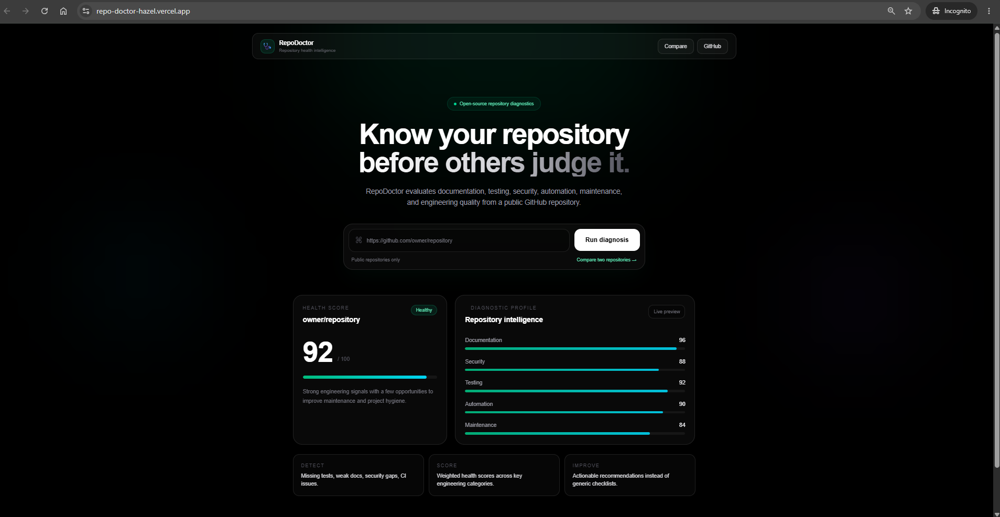
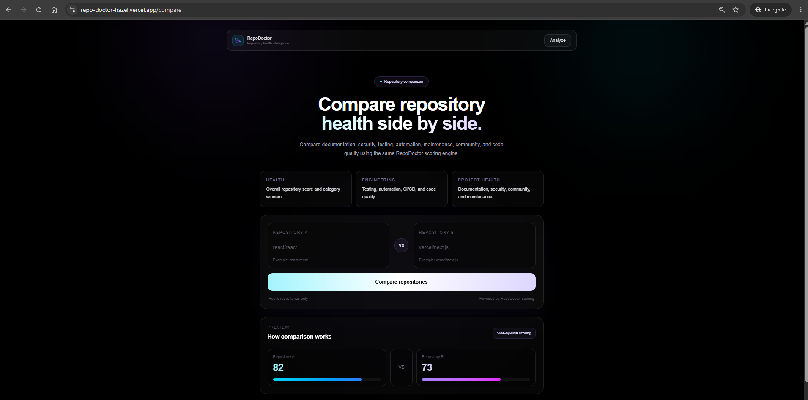

# 🩺 RepoDoctor

> Repository health intelligence for GitHub projects.

[](https://repo-doctor-hazel.vercel.app)
[](https://github.com/Jewel777/RepoDoctor/actions/workflows/ci.yml)
[](https://github.com/Jewel777/RepoDoctor/actions/workflows/codeql.yml)
[](https://github.com/Jewel777/RepoDoctor/releases)
[](LICENSE)

**RepoDoctor is an open-source GitHub repository health analyzer that turns repository signals into clear scores, diagnostics, and actionable recommendations.**

Paste a public GitHub repository URL to analyze documentation, security, testing, CI/CD, maintenance, community health, release practices, and engineering quality.

RepoDoctor also supports **side-by-side repository comparison**, allowing developers to evaluate two open-source projects using the same scoring engine.

---

## ✨ Features

RepoDoctor currently provides:

- overall repository health scoring;
- category-level scoring for documentation, security, testing, maintenance, automation, community health, and code quality;
- repository metadata and maintenance intelligence;
- README quality and completeness analysis;
- automated test-file and testing-framework detection;
- GitHub Actions / CI/CD workflow intelligence;
- security-policy, Dependabot, dependency-lockfile, and security-scanning checks;
- project-engineering checks such as TypeScript, linting, formatting, build scripts, environment templates, and Docker support;
- release-history and versioning intelligence;
- community-health checks including contributing guidelines and issue / PR templates;
- prioritized critical issues, recommendations, and passed checks;
- large-repository safe scanning;
- authenticated GitHub API support for improved reliability;
- side-by-side repository comparison with category winners and overall comparison results;
- responsive desktop and mobile interface.

---

## 🖥️ Preview

### Repository Health Analysis

RepoDoctor provides a focused repository-health workflow with scoring across documentation, testing, security, automation, maintenance, and engineering quality.



### Repository Comparison

Compare two public GitHub repositories side by side using the same RepoDoctor scoring engine.



---

## ⚖️ Repository Comparison

RepoDoctor v1.1 introduces side-by-side repository comparison.

For example:

```text
react/react
