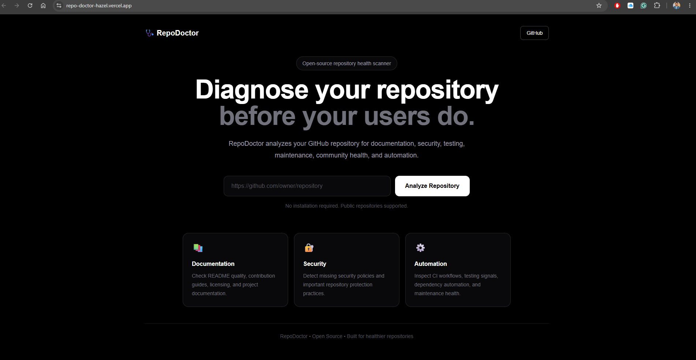

# 🩺 RepoDoctor

> Diagnose your repository before your users do.

[](https://repo-doctor-hazel.vercel.app)
[](https://github.com/Jewel777/RepoDoctor)
[](LICENSE)

**RepoDoctor helps developers instantly evaluate the health of any public GitHub repository.**

It analyzes documentation, security, testing, community readiness, maintenance, and automation — then turns those signals into a clear repository health score with actionable improvement opportunities.

## 🖥️ Preview



## 🌐 Live Demo

Try RepoDoctor here:

**https://repo-doctor-hazel.vercel.app**

Paste any public GitHub repository URL and receive an instant repository health report.

Example:

```text
https://github.com/Jewel777/RepoDoctor
